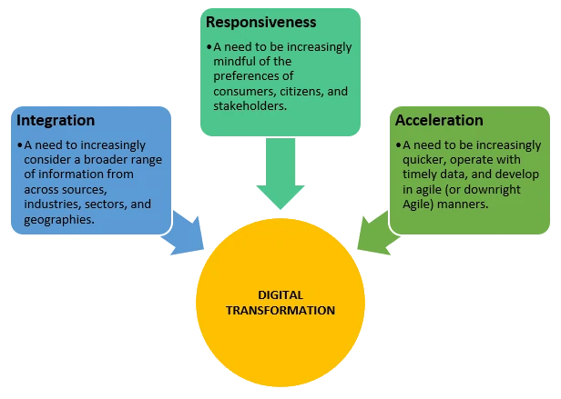

Everyone is talking about digital transformation, but what drives said transformation in sustainability?

The full answer is complicated, of course. Several themes, technologies, and actors influence how organisations approach the [digital sustainability](/blog/digital-sustainability) challenge. So, let's talk big picture in this post.

Three general trends always seem present at the most general level, especially in sustainability. 

### Top-level drivers
These three top-level drivers are [the need for] integration, responsiveness, and acceleration.

#### Integration
Organisations worldwide are increasingly interested in integrating vast amounts of data from numerous and often disparate sources. This trend is evident in sustainability.

As per the [UN](https://www.un.org/en/climatechange/science/causes-effects-climate-change) and the [European Commission](https://climate.ec.europa.eu/climate-change/causes-climate-change_en), the causes of climate change are many, including power generation, manufacturing, deforestation, transportation, food production and over-consumption. The effects of climate change are also multi-pronged, including, as per the [IPCC](https://www.ipcc.ch/2021/08/09/ar6-wg1-20210809-pr/) and the [CDC](https://www.cdc.gov/climateandhealth/effects/default.htm), an intensified water cycle, changing rainfall patterns, sea level rise, changes in city conditions, and higher health risks. Data from numerous domains is needed to understand climate change and its effects. Additionally, responding to climate change requires coordination, which often involves integrated communications, agendas, platforms and, in some cases, joint projects and organisational mergers.

Unsurprisingly, salient digital sustainability efforts have enormous data integration requirements. For instance, ESG scores by salient providers such as [Refinitiv](https://www.refinitiv.com/en/sustainable-finance/esg-scores) and [Sustainalytics](https://www.sustainalytics.com/esg-data) build on hundreds of indicators and thousands of data points. Similarly, the 17 [UN SDGs](https://sdgs.un.org/goals) consist of [169 different targets and 231 *unique* indicators](https://unstats.un.org/sdgs/indicators/indicators-list/).

In sustainability, thus, the need for integration is partially but significantly driving the digital transformation.

#### Responsiveness
The desire for personalised or tailored solutions that adapt and respond to the needs of individual customers or citizens is rising across fields of human activity, not just in sustainability. 

We live in an era of customer-centric organisations. Companies are using data to [know what customers want before customers know they want it](https://hbr.org/2011/12/know-what-your-customers-want-before-they-do). [Public organisations are widening stakeholder engagement and accountability](https://doi.org/10.1080/13501763.2020.1817127), which organisations like [McKinsey](https://www.mckinsey.com/industries/public-and-social-sector/our-insights/implementing-a-citizen-centric-approach-to-delivering-government-services) call a citizen-centric approach to public services. [Customers](https://www.imd.org/research-knowledge/articles/why-all-businesses-should-embrace-sustainability/) and [citizens](https://www.openaccessgovernment.org/uk-citizens-interest-sustainability-sustainable-practices/152965/) increasingly value and expect sustainability.

Responding to this desire for sustainability requires more than simply having sustainable products. [Deloitte](https://www2.deloitte.com/content/dam/Deloitte/fr/Documents/sustainability-services/deloitte_make-it-maerkbar_juin-15.pdf), for example, suggests appealing to and empowering customers to promote and engage with sustainable products, all while being tangible and transparent. Organisations need data and digital tools to do this. Similarly, experts believe [data is critical to engaging with citizens in the context of sustainable development](https://sdghelpdesk.unescap.org/sites/default/files/2019-05/UNU-CS-DataSD-Report-Engaging-Citizens-20181004-compressed.pdf).

In sustainability, the need to respond to customers'/citizens' needs is partially but significantly driving the digital transformation.

#### Acceleration
Finally, speed is of the essence. Due to the increasingly pressing challenges of climate change, notable organisations like the [UNEP](https://www.unep.org/facts-about-climate-emergency) now refer to the situation as THE climate emergency.

The time for developing and launching projects and products has reduced, with Agile methodologies now a new standard. That said, the time pressures actors in sustainability face are, quite frankly, brutal. 

The [IPCC](https://www.ipcc.ch/2022/04/04/ipcc-ar6-wgiii-pressrelease/) noted recently that we can halve global emissions by 2030 to limit global warming to 1.5°C (2.7°F) if we act now, but that “accelerated and equitable climate action in mitigating and adapting to climate change impacts is critical to sustainable development”. The [UNFCC](https://unfccc.int/news/climate-plans-remain-insufficient-more-ambitious-action-needed-now) has also noted that “ambitious climate action before 2030 is urgently needed to achieve the long-term goals of the Paris Agreement”. 

Digital technologies have a footprint of their own, which needs management, but many see them as an opportunity for rapid decarbonisation. The [World Economic Forum](https://initiatives.weforum.org/digital-transformation/climate-scenarios) suggests decarbonisation is possible by simultaneously implementing four digital technologies clusters: foundational solutions for measurement, reporting, and analytics; enabling technologies like blockchain to increase speed and trust in transactions; better decision-making tools like digital twins and AI/ML; and sensing/control technologies like IoT, automation, and drone imaging. [Experts at the IMF](https://www.imf.org/en/Blogs/Articles/2022/08/23/achieving-net-zero-emissions-requires-closing-a-data-deficit) believe “achieving et-zero emissions requires closing a data deficit”. In short, decarbonisation will unlikely happen without significant changes in how organisations do things, and digital technologies are the best shot we have at delivering these changes.

In sustainability, the need to decarbonise rapidly is partially but significantly driving the digital transformation.

### Transformational currents
The digital transformation is not solely about how organisations perceive the need to integrate data and activities, respond to customers/citizens, and act increasingly rapidly. Numerous factors, actors, trends, and technologies influence how different actors approach their digital sustainability challenges. However, for reasons noted, these three needs seem to influence all digital transformation in sustainability.

It is helpful to think of these three drivers as we do of oceanic currents, which touch everything in the sea, even if their final effect varies across the planet. In sustainability, digital transformation will be influenced by how organisations perceive the need to integrate data and activities, respond to customers/citizens, and act increasingly rapidly, even if other factors influence outcomes too.

Learning how to make the most of synergies across the three needs and how to minimise potential conflicts will not guarantee success. A successful digital transformation strategy needs more. However, understanding how [the need for] integration, responsiveness, and acceleration affect digital transformation seems vital to success.