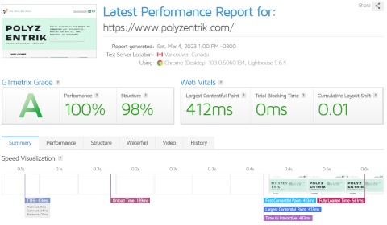

Bear with us for a minute. We are about to seriously humble brag.

[Ando and I announced some weeks ago that we were working hard to bring you a website that is, all, fast, beautiful, and sustainable](/blog/working-hard). We’ll never finish improving – there is always room for improvement, but we’ve already managed a lot.

### Fast
The screenshot below shows Polyzentrik’s [latest performance report by GTmetrix](https://gtmetrix.com/reports/www.polyzentrik.com/NERymBSh/). The headline result is a 100/100 in performance – not bad at all! Equally, load times stand at around half a second, which we think is good by any standards.

We also checked against [Google’s PageSpeed Insights](https://pagespeed.web.dev/report?url=https%3A%2F%2Fwww.polyzentrik.com%2F&form_factor=desktop). The result is lower (*sad face): 99/100 (!) in the desktop view. We believe most users will be desktop-based, so we focused there.

Scores are similar to those by GTmetrix. That said, ironically since PageSpeed Insights is a Google product, the test does not seem fond of Google Fonts. The *one* Google Font used in the website is bringing speed down significantly. We considered removing the one Google Font the site uses. By the looks of it, this could enable under-half-a-second load times. However, the site is already fast, and the font is vital for the site’s looks.

### Beautiful
Beauty is and will always be in the eye of the beholder. That said, in our opinion, the site is also deliciously good-looking.

We used Bootstrap as the foundation for the site’s aesthetics and complemented it with a little vanilla CSS. For instance, the imperceptible-yet-hypnotic mesh background is a repeating linear gradient. The [services](/services) and the [blog](/blog) pages are generated by the same file, which directs content to the appropriate section based on its type. However, they look different due to differences in the order of blocks and CSS classes. Also, the headings of [individual service listings](/services/content) are vertical thanks to a little writing mode trick and a rotation.

Not everything is down to the CSS, though. We are delighted with the ASCII roadmap. Also, as announced earlier, links and headers use a Google Font called *Unbounded*. As per Google’s PageSpeed Insights, this font costs 230 milliseconds in load time. It’s a significant trade-off, but one that had to be made.

### Sustainable
All was achieved sustainably. The screenshot below is the [performance report by the Website Carbon Calculator](https://www.websitecarbon.com/website/polyzentrik-com/). Per their analysis, the site is in the top 10% of all pages tested, producing only 0.08g of CO2 per visit. 

We also ran the site against [Digital Beacon](https://digitalbeacon.co/report/polyzentrik-com). Their result, we particularly like. In their words, our site is **AMAZING** when it comes to its carbon footprint. That said, they estimate the site produces ~0.2g of CO2 per visit, more than the Carbon Website Calculator’s estimate.

### Remaining opportunities
There is room for improvement in all aspects. The speed could increase further if we find how to reduce the impact of the one Google Font the site uses. Some files still need to be cached, and this will also improve performance. 

On the aesthetics front, the site will also become more beautiful once we finish addressing accessibility concerns. Also, we want to experiment a little with animations.

Sustainability-wise, there is a need to check each individual page. Not all individual pages are necessarily optimised. This blogpost, for instance, has many images. It likely produces more CO2 per load than the home page. These challenges, however, seem normal for a website and must be addressed under a continuous improvement mentality.

Finally, there is room for improving an aspect of the site we do not control. The site sits on an AWS S3 Bucket based on an [AWS location that has been externally verified to run on renewables](https://www.thegreenwebfoundation.org/green-web-check/?url=++s3.eu-central-1.amazonaws.com), but the Content Delivery Network (CDN), AWS CloudFront, does not yet run entirely on renewables.

[AWS CloudFront is scheduled to become 100% renewables by 2025](https://dev.to/aws-builders/building-a-greener-cloud-the-role-of-an-architect-for-sustainability-in-aws-cge). Meanwhile, we could get Polyzentrik to show as hosted green by serving requests directly from the S3 bucket. However, this would questionable as this would mean data travelling across numerous servers from Germany to user location each time the site is visited by any user anywhere. By serving content from near final users, CDNs avoid the need to repetitively send data across the planet.

There is a CDN provider that we think runs entirely on renewables. What moved us to choose AWS over them is that AWS has sustainability analytics tools that justify the wait, but we'll talk about that later in a different post.

### Conclusion
There you have it. Polyzentrik now has a site that is, all, fast, beautiful, and sustainable! [Digital sustainability](/blog/digital-sustainability) at its best.

Get in touch if you also want a website that reflects your genuine commitment to sustainability and, why not, gives you an excellent reason to humble brag a bit about your digital sustainability.