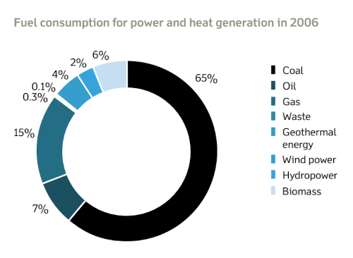

Though not specifically about digital sustainability, the history of Orsted offers inspiration for any organisation thinking about undertaking a digital transformation. It shows that if you truly commit to transforming an organisation into a better and more sustainable version of itself, you can become a leader in a new world regardless of where you start. 

### Orst… Who?
Orsted is a Danish energy company now known as one of the world’s most sustainable corporations.

This was not always the case. Before becoming Orsted, the company was known as DONG, short for Dansk Olie og Naturgas A/S. Dong was involved in oil, gas, and coal. 

Yet, the company embarked on an ambitious transformation that led it to become a world leader in sustainability.

### Why?
In 2006, something between [83](https://orsted.com/en/about-us/about-orsted/powering-the-world-with-green-energy) and [87](https://web.archive.org/web/20111002050120/http://www.dongenergy.com/SiteCollectionDocuments/%C3%85rsrapporter/annual_report_2006.pdf) per cent of the heat and power generated by DONG came from fossil fuels. The company accounted for about a **third** (!) of Denmark’s emissions.

DONG’s Executive Managers were reportedly concerned by the company’s carbon footprint. There was also pressure for change in the context of the Copenhagen Climate Summit in 2009.

The company wanted and needed a new direction.

### How?
So, DONG set itself on an ambitious transformation process that ultimately led to changing its name to Orsted in 2017.

In 2009 the soon-to-be-Orsted company set a clear vision at the top, the 85/15 vision, a pledge to flip the company’s energy profile from 85% black and 15% green fuels to 85% green and 15% black by 2040. 

The vision was then promoted across the organisation and gained prominence steadily. 

Spearheading the vision was a commitment to shutting down all coal plants and investing heavily in renewables. [DONG had already acquired three offshore wind facilities](https://www.greenbiz.com/article/nordic-energy-giant-shows-how-carbon-turnaround-happens). The company doubled down on this strategy, [investing significantly in more renewable generation and converting coal- and gas-powered facilities into biomass](https://orsted.com/en/about-us/about-orsted/about-our-name). 

Over time, the company moved from the local to the global level. In doing so, the company became one of the world’s green energy majors.

#### Challenges
DONG was an oil, gas, and coal company. Not everything was smooth sailing. Some investors and employees were bound to feel unease about the transition. 

Key to managing this aspect of the transformation was clear leadership and motivation. Instead of simply spurring the visions on employees, the then-CEO Anders Eldrup took it upon himself to sell the transformation. He communicated the vision clearly and supported it on a [need for action on climate change and as a “sustainable business model to stay relevant and competitive”](https://orstedcdn.azureedge.net/-/media/www/docs/corp/com/about-us/whitepaper/our-green-business-transformation---what-we-did-and-lessons-learned.ashx).

Regardless, markets still deemed the transformation risky. There was a need to show financial results. 

However, the company faced an unexpected hurdle.

Orsted’s 85/15 vision [originally included gas as part of the solution](https://web.archive.org/web/20100608143055/http://www.dongenergy.com/EN/About%20us/Moving_Energy_Forward/Pages/Moving_Energy_Forward.aspx). This aspect of business suffered significantly in 2012 when prices dropped substantially in the US. Financial results that year were dissatisfactory. 

The drop in financial performance was a challenge that became an opportunity. The situation must have given strong arguments to nay-sayers. However, problems were isolated to the gas side of the business, so the situation became a powerful justification for transitioning into true renewables.

### Results
Results have thus far been [deemed successful](https://racetozero.unfccc.int/from-fossil-fuels-to-renewables-within-a-decade-key-lessons-from-orsteds-green-transformation-2/). 

The transition changed organisational priorities completely, invigorating the company.

* In 2009, while the company already acknowledged climate change as a problem, it believed the way forward was [quotas](https://web.archive.org/web/20090801032707/http://www.dongenergy.com/en/responsibility/climate/pages/global%20warming.aspx) rather than, per se, transformation. 
* In 2013, DONG’s website was already open about the [need for an energy transition](https://web.archive.org/web/20130313012524/http://www.dongenergy.com/EN/Responsibility/our_approach/the_need_for_an_energy_transformation/pages/default.aspx) and the company’s [interest in leading this transformation](https://web.archive.org/web/20130321085918/http://www.dongenergy.com/EN/Innovation/Pages/index.aspx?WT.mc_id=Innovation_EN).
* By 2017, the [website of the newly created Orsted](https://web.archive.org/web/20180315214220/https://orsted.com/en/About-us/About-orsted/About-our-name-change) read as a manifesto. 

In less than ten years, the company went from a tired-old business running on inertia to a vibrant organisation proactively leading the green energy transition.

Additionally, Orsted achieved goals much faster than stated. The 85/15 vision was completed in 2019, 21 years ahead of schedule, and Orsted did not stop there. The company has by now reduced its heat and power coal consumption by 91%, with only one remaining coal-fired plant. Orsted is poised to become carbon neutral in 2025.

Finally, financial results have also been satisfactory. Stock prices increased after the transformation and have been holding despite significant pressure from the current economic situation. Also, the company has posted a net income every year since 2016.

. Source: Orsted's 2020 & 2022 Annual Reports. ")

### Conclusion
DONG was one of the dirtiest corporations in the world. Orsted is one of the most sustainable companies on the planet. While Orsted’s transformation is not specifically about digital sustainability, it shows that the starting point of a sustainability transformation does not determine the outcome.

It can be done! 

Moreover, Orsted shows best practices that seem crucial to successfully transforming an organisation into a better and more sustainable version of itself.

**Vision and engagement.** Managers must believe in the need for transformation and be willing to advocate and work for it – not just hope the change will ensue from ordering others to do it.

**Clarity.** There is little room for ambiguity. Clear justification. Clear goals. Clear support from the top. All are important to success. 

**Incremental action.** Pledges only work if accompanied by actions. Actions, in turn, must be connected and add up over time.

**Adaptation.** No plan survives reality. Expect having to adapt.
