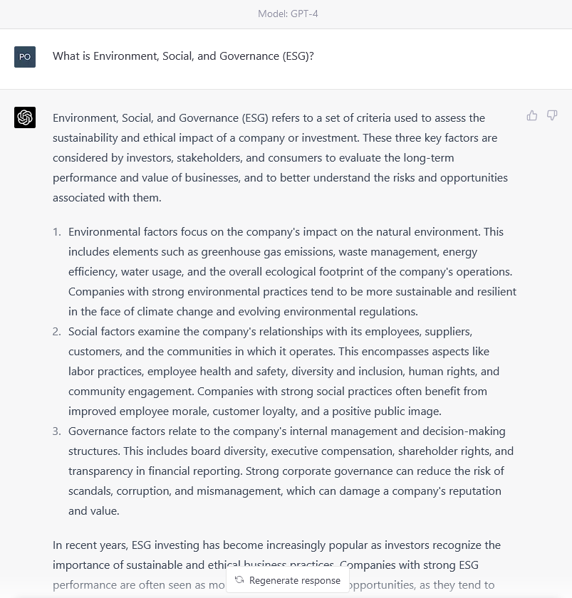
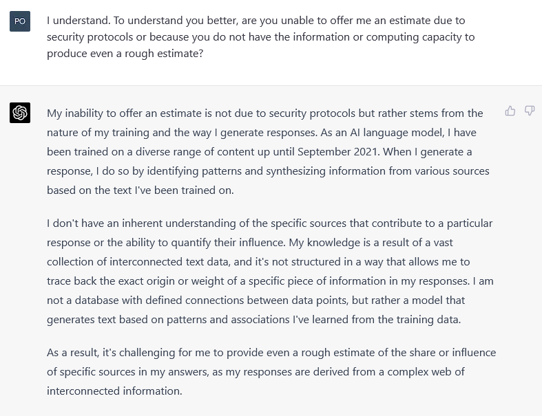
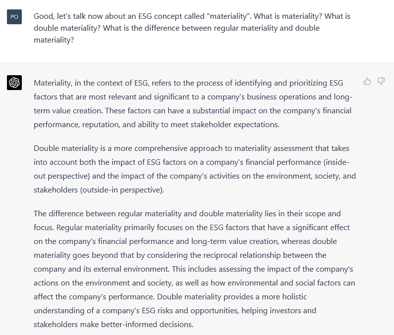

When you read [last week’s blog post about Environment, Social, and Governance (ESG)](/blog/what-is-esg-gpt-4/), you read sustainability content generated entirely by AI, OpenAI’s GPT-4. 

The blog post will not win us a Pulitzer. However, it seems sufficiently accurate to satisfy the requirements of marketing copy, i.e., content geared to spreading the word about and getting potential customers interested in products/services.

This post details the process underneath and related limits and opportunities.

### The starting point
We started last week’s post by simply asking GPT about ESG. 

Unfortunately, the answer was miles away from anything we could consider satisfactory. GPT replicated a common misconception: that ESG is specifically about a company’s effects on the planet and society.
 

ESG covers both (1) the impact ESG risks have on the financial performance of a company and (2) the impact a company has on the planet and society, i.e., whether it exacerbates or helps to manage/reduce ESG risks. 

Acknowledging the two aspects of ESG is fundamental. 

The driving force in ESG is the idea that companies may benefit financially from reducing their ESG impacts and, therefore, exposure to ESG risks. An explanation of ESG that ignores either aspect of this reciprocal dynamic fails to represent ESG accurately. It may even mislead readers into thinking ESG is something it is not.

### An attempt at referencing – a non-solution
The initial idea to try and improve GPT’s answer was to ask it to generate a new version based solely on authoritative sources, which are less likely to over-simplify. 

To this end, we asked GPT for a list of the 50 most reputable sources of information about ESG. The plan was to use this list to request a new version based on what these organisations say about ESG. 

Alas, things went downhill after a few prompts.

GPT generated a list containing several organisations that are indeed salient in ESG. However, to get a lay of the land, we asked for an estimate of how much these organisations influenced GPT’s original answer. The conversation was long. Several attempts were made. Still, the summary is that while GPT acknowledged the organisations likely had an influence, it could not estimate how significant the influence was.

Insisting only made things worse. GPT even noted it was incapable of referencing due to its training data being structured in a way that made this kind of traceability impossible.

The exchange was concerning. 

What GPT wrote in its first attempt was very general. We planned to run it through a plagiarism check anyways, but it all seemed general knowledge that does not need referencing. However, a rewrite based on specific sources would need referencing. Also, it is not like we could credit all 50 organisations for the piece of text. It would be necessary to know what bit came from each or, at the very least, each organisation’s relative influence on the final text. 

This approach was a dead end.

### Anchoring and prompt chaining – an actual solution
The next idea was to try and mimic reasoning. This approach was more successful and led to the version of the [article you can read in our blog](/blog/what-is-esg-gpt-4/).

GPT cannot engage in reasoning. It is a language model that will only replicate existing patterns in its training data. However, GPT’s training data likely includes texts about concepts deemed pivotal in different sectors, industries, regions, etc. These conversations likely involve a degree of reasoning. 

So, we decided to ask it to link its initial answer to ESG concepts that could act as check-and-balances for the biases in the initial response. 

Again, do not think of this as reasoning. Think of it instead as nudging GPT towards a subset of the patterns in its training data, specifically, subsets about or related to specific concepts. The assumption is that the type of reasoning in said subsets is more likely to be accurate, leading to better responses by the language model.

The ESG concept we chose to anchor GPT is known as “double materiality”, which [experts explain as](https://www.lse.ac.uk/granthaminstitute/news/double-materiality-what-is-it-and-why-does-it-matter/): 

> Information on a company is material and should therefore be disclosed if “a reasonable person would consider it [the information] important”[…] The concept of double materiality takes this notion one step further: it is not just climate-related impacts on the company that can be material but also impacts of a company on the climate – or any other dimension of sustainability.

The “double materiality” concept requires thinking of both the impact ESG factors have on a company’s financial performance and the impact a company has on the planet and society. It would be difficult for written material about or related to this concept to forget about either side of ESG.

So, we asked GPT to offer an overview of this concept, then established the concept is central to ESG, and, finally, asked it to rewrite in a way that would not contradict the idea of double materiality. 

The result is the [article that you can read from our blog](/blog/what-is-esg-gpt-4/). 

The final version lacks the analytical depth an ESG expert could provide. However, it introduces ESG in a way that could grab the attention of people who are not ESG experts. It is also engaging and well-written. Good content, if judged as marketing copy.

### Remaining issues
Notwithstanding the above, the blog post remains a little derivative and is too general to be helpful in more scientific contexts.

We ran the answer through Grammarly’s plagiarism algorithm. Nothing of concern came up. Furthermore, the final version is still sufficiently general to live without references. If journalists and copy marketers do not need to quote general diatribes, should AI?

However, moving towards more specific (indeed better) content seems impossible without significant human intervention. Specificity would require traceability at a level that enables reliable referencing. 

GPT failed monumentally in this regard. 

Not for the lack of trying. Besides the attempt to get an estimate of the extent to which answers rely on specific sources, we also asked for a paragraph about the increasing popularity of ESG that included confirmable facts.

Alas, two of the three sentences contained issues as detailed below:

> According to the Global Sustainable Investment Alliance (GSIA), sustainable investments grew by 15% between 2016 and 2018, reaching $30.7 trillion in assets under management globally (This sentence seems wrong. GSIA reports [34% increase between 2016 and 2018 for a total of $30.7 trillion at the start of 2018](http://www.gsi-alliance.org/wp-content/uploads/2019/03/GSIR_Review2018.3.28.pdf) or [15% growth between 2018 and 2020 for a 35.3 trillion total](https://www.gsi-alliance.org/wp-content/uploads/2021/08/GSIR-20201.pdf)). This upward trend has continued, with a record $51.1 billion of net inflows into ESG funds in the United States alone in 2020, as reported by Morningstar ([Confirmed](https://www.morningstar.com/articles/1019195/a-broken-record-flows-for-us-sustainable-funds-again-reach-new-heights)). Furthermore, a 2020 survey by PwC found that 77% of institutional investors planned to stop purchasing non-ESG products by 2022, indicating the increasing significance of ESG factors in investment decision-making. (This sentence also seems wrong. A [PwC report](https://www.pwc.lu/en/banking/docs/pwc-banking-in-lux-trends-figures-2021-vd.pdf) found that “while 77% of institutional investors in PwC’s 2020 ESG survey stated that they were ready to stop investing in non-ESG products by 2022, only 14% of asset managers planned to stop launching these products by the same period”.)

After a few attempts, we got it to rectify the first sentence, reason why the paragraph (less the third sentence) made it to last week’s blog post. 

However, things got weird when trying to get it to address the third sentence. In our view, GPT did not even come close to grasping what the dissatisfaction was. Furthermore, it might have hallucinated when trying to justify its answer, as it offered links we could not locate online or in an Internet Archive.

Additionally, the inaccuracies and the difficulties getting GPT to fix the issues engendered a different problem best described as a ‘what if’ situation: What if the final version of the text still contains something not fully representative of reality? What if we missed something out of sheer mental exhaustion? Etc, etc. 

It is hard not to feel uneasy about potential oversights. The risk of accidentally missing something exists. If used repeatedly, something will go unnoticed at some point. 

Therefore, a degree of crowd-checking seems needed to scale any AI content generation strategy, at least in sustainability, where omissions can be costly.

### And yet…
Yet, while all the above took place in separate conversations, the total amount of time spent was surprisingly short. Writing the same blog post, but manually, would have taken significantly longer than it took to generate it. 

Furthermore, although adequate supervision and some creative prompts (#selfbrag) were needed, the final version of the blog post satisfies the requirements of general or introductory marketing copy.

### Conclusion
The risks are evident, but the opportunity is undeniable.

Sustainability content strategies typically involve a combination of many different types of material. Long- and short-format material, deep expert-driven insights, marketing content geared for non-experts, overviews at various levels of specificity, and so forth, all are part of a complete strategy. It is a lot of content, and sometimes, there is limited time to produce it.

While it is currently impossible to base the entirety of one such strategy on AI, AI can significantly augment the bandwidth of existing efforts. 

Language models like GPT-4 can help in the process of brainstorming and editing content – everyone knows this by now. Additionally, approached carefully, there seems to be room for using language models like GPT-4 to generate sustainability content directly. 

Limitations exist. It seems advisable to limit direct generation to general or introductory marketing; else, the risk of plagiarism and mistakes is unjustifiable. It also seems advisable to have content checked by several eyes before making it public, as things might go unnoticed even if experts are involved. Finally, it might also be worth trying other language models to see if they hopefully manage traceability better (Bard!?).

That said, approached carefully, AI could help generate introductory/marketing sustainability content directly and satisfactorily.

